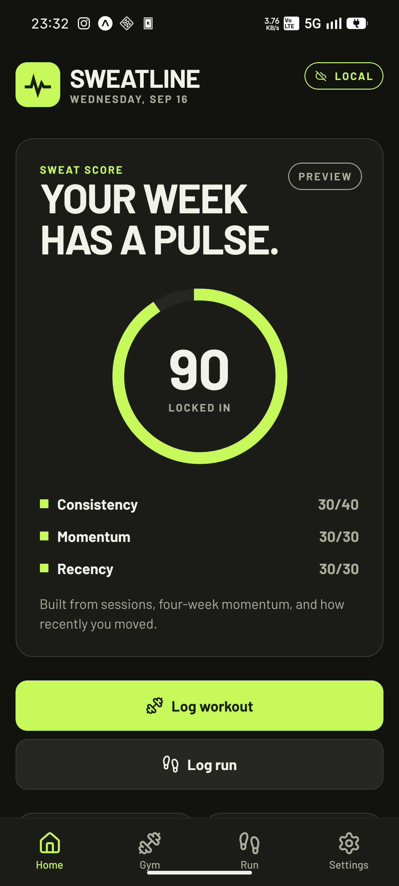
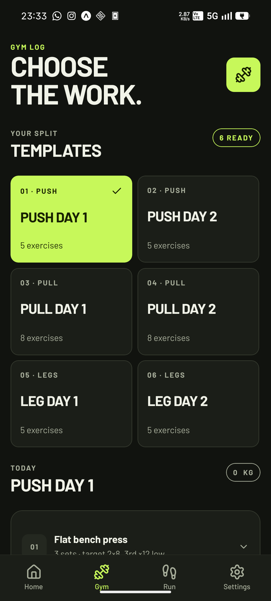
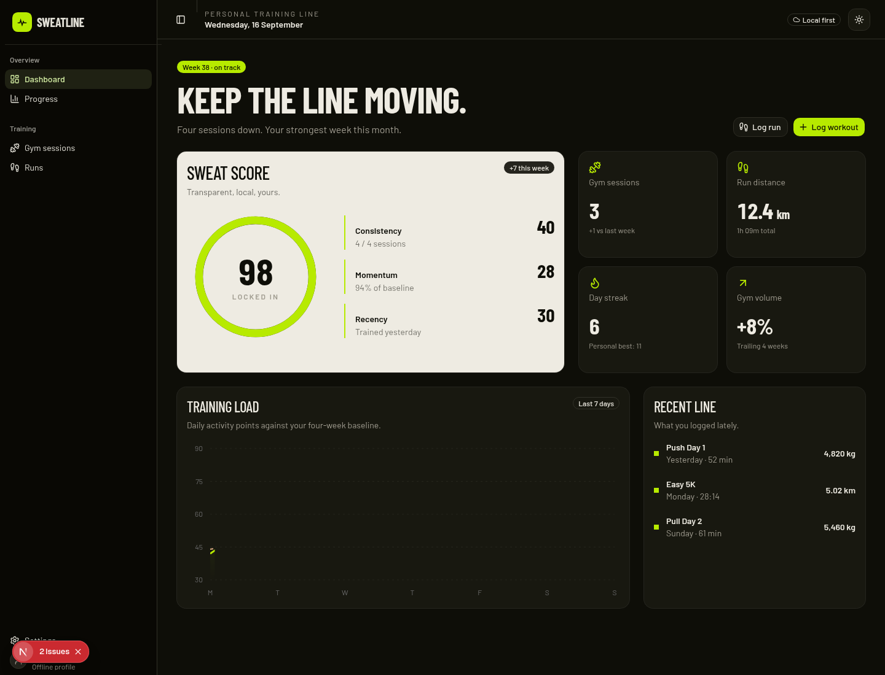
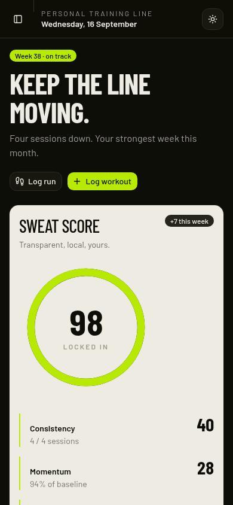

# Sweatline

Personal training tracking on Android and the web.

Sweatline helps you log gym sessions and runs without turning training into a social feed. Choose or build workout templates, adjust exercises for the day, record distance and elapsed time, and see a clear record of your consistency. The Android app works offline first and keeps changes queued until you choose to sync.

## Get Sweatline

- **Android:** [Download the latest preview APK](https://github.com/wrestle-R/Activity-tracker/releases/download/v1.0.0-preview.1/sweatline-v1.0.0-preview.1.apk)
- **Web:** [sweatline-rdp.vercel.app](https://sweatline-rdp.vercel.app)

## What it is for

- Logging gym workouts from templates, including one-off exercises.
- Recording runs with distance, elapsed time, and calculated pace.
- Keeping a private, local-first training history when you are offline.
- Reviewing recent activity and a transparent consistency signal across Android and the web.

## Screenshots

### Android

| Home | Gym logging |
| --- | --- |
|  |  |

### Web

| Dashboard | Mobile web |
| --- | --- |
|  |  |

Screenshots contain sample training data only. No account credentials or personal account identifiers are shown.

## Development

- expo/ contains the offline-first Expo Android app.
- next/ contains the web dashboard.
- docs/ contains build notes and QA artifacts.
